#python day02
##实战十一: 判断输入的是不是黄蓉所说的数
###使用if语句判断用户输入的数字是不是黄蓉所说的除以3余2，除以5余3，除以7余2的数，如果正确请输出，不正确提示用户输入有误
>黄蓉原句：今有物不知其数,三三之数剩二，五五之数剩三，七七之数剩二，问几何?
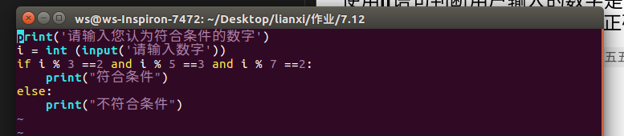
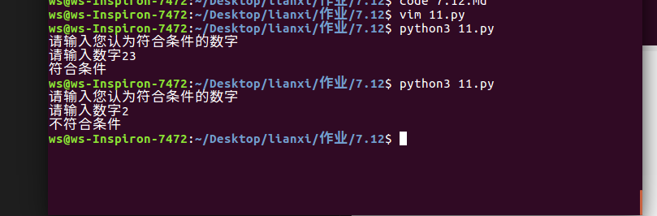

#使用 if---elif---else 多分支语句实现根据用户输入的玫瑰花的朵数输出其代表的含义
*1朵:你是我的唯一
*3朵：I Love You
*10朵： 十全十美
*99朵：天长地久
*108朵： 求婚
*999朵： 土豪
*其他：可以考虑送1朵、3朵、10朵、99朵、108朵、999朵 效果图片
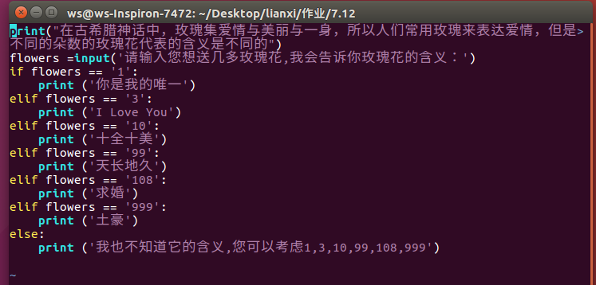
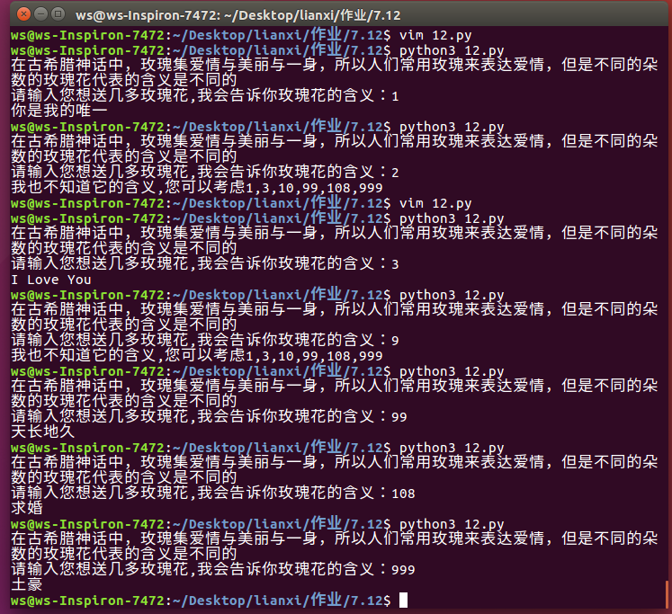

#实战十三: 判断是否为酒后驾车
>背景:国家质量监督检查检疫局发布的《车辆驾驶人员血液,呼气酒精含量阙值与检验》中规定：车辆驾驶人员血液中的酒精含量小于20mg/100ml不构成饮酒驾车行为；酒精含量大于或者等于20mg/100ml、小于80mg/100ml为饮酒驾车；酒精含量大于或者等于80mg/100ml为醉酒驾车。
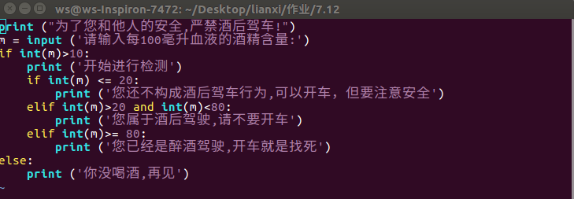
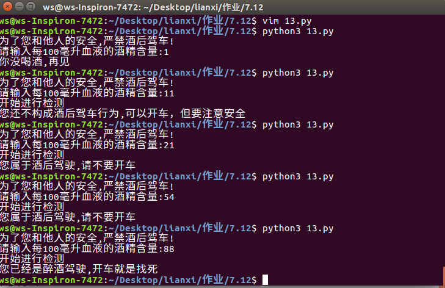

#实战十四: 简化版:猜数字游戏
编写一个猜数字的小游戏,电脑随机生成一个1到10之间的数字作为一个基准数,玩家输入一个数字,如果玩家的数字和电脑随机生成的基准数一致则输出"胜利",否则输出"失败,你是一个loser"
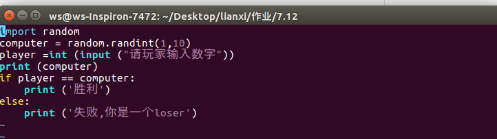
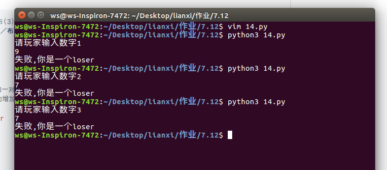

#实战十五: 简化版:模拟10086查询功能
编写Python程序，模拟10086自助查询系统的功能： 输入1，显示您当前的余额； 输入2，显示您当前剩余的流量，单位为G; 输入3，显示您当前的剩余通话, 单位为分钟；
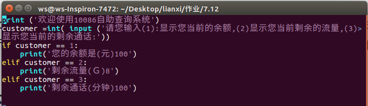
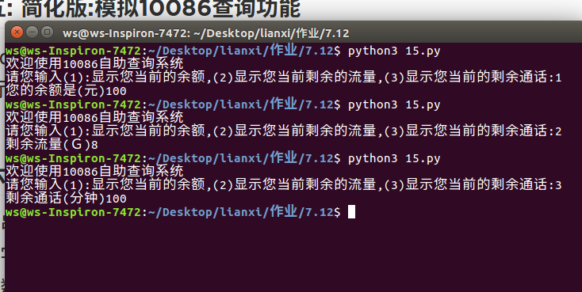

#实战十六: 对用户星座进行分析并输出结果
使用字符串"请输入您的名字:"提醒用户输入名字,接着格式化打印星座对应日期信息，使用字符串"请根据如上提示选择对应编号"(例如,水瓶座请输入:1)提醒用户根据信息输入数字，最后根据用户的输入直接打印分析结果,输出结果为"名字,您好！XX星座的您分析结果:日期是XXXX，性格是XXXX"
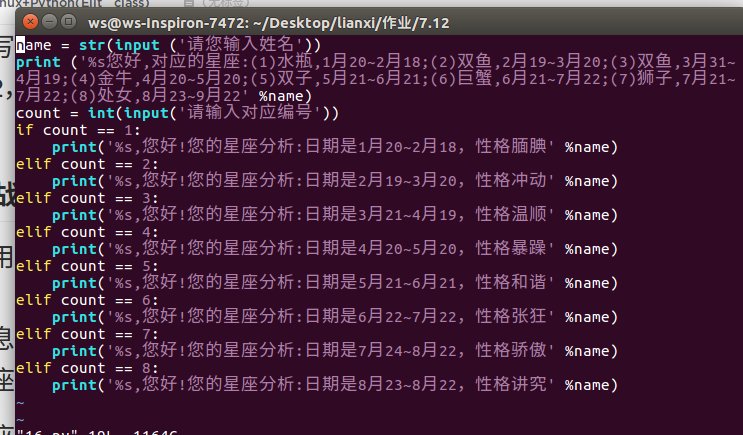
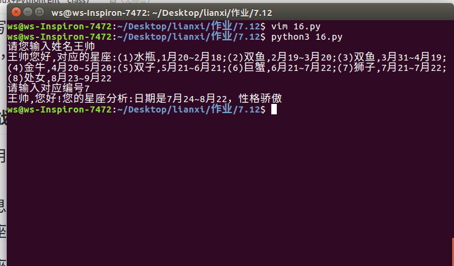

#实战十七: 帮助小明判断BMI指数
小明身高1.75，体重80.5kg。请根据BMI公式（体重除以身高的平方）帮小明计算他的BMI指数，并根据BMI指数： 低于18.5：过轻 18.5-25：正常 25-28：过重 28-32：肥胖 高于32：严重肥胖 用if-elif判断并打印结果
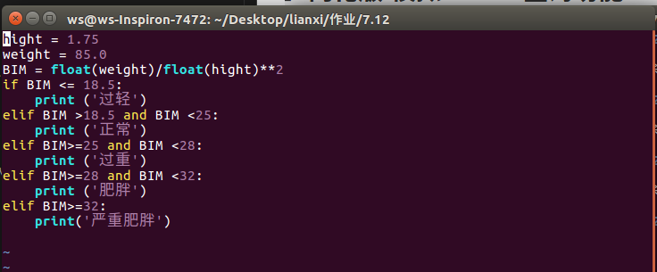
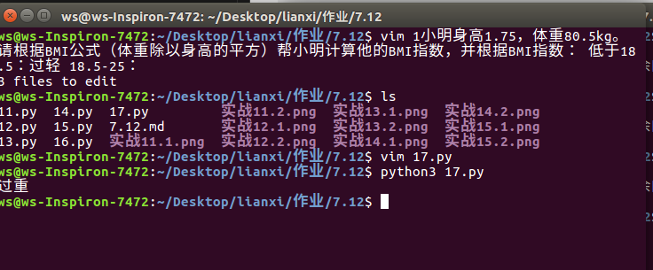
实战十八: Bank

#去银行取钱

定义一个账号
定义一个密码
定义一个金额
输入账号和密码
假如账号和密码是对的
就可以开始取钱了
请输入取钱金额
假如里面的金额不够、就提示没钱取毛线
如果够 就告诉取了多少钱 还剩多钱
如果账号密码不对
提示非法账户
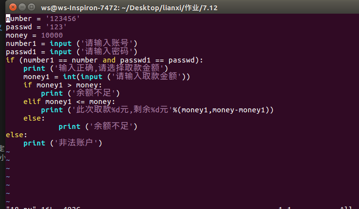
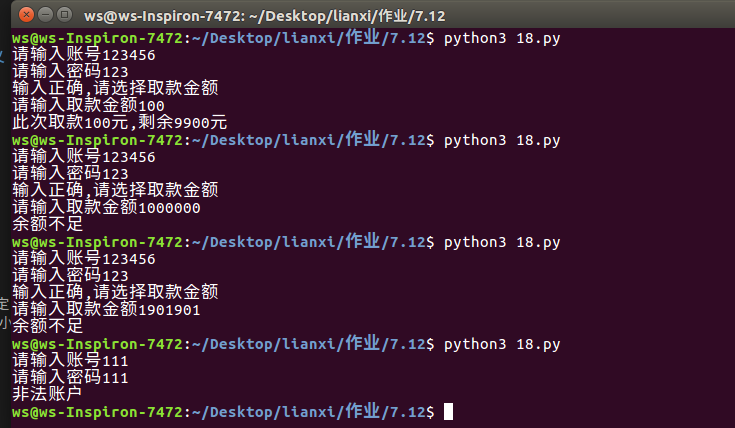

#实战十九: 颜值大比拼
请输入身高
请输入身价
输入颜值分
假如你的身高大于180 并且身价大于1000000 并且颜值大于99分 就可以是高富帅
假如身价大于1000000 并且颜值大于99分 就可以是富帅
假如颜值大于99分 就可以是帅
假如你的身高小于160并且身价小于100并且颜值小于60分 就可以是矮穷矬
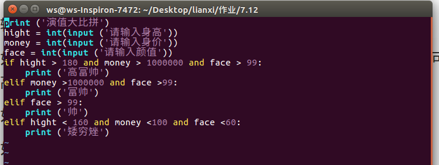
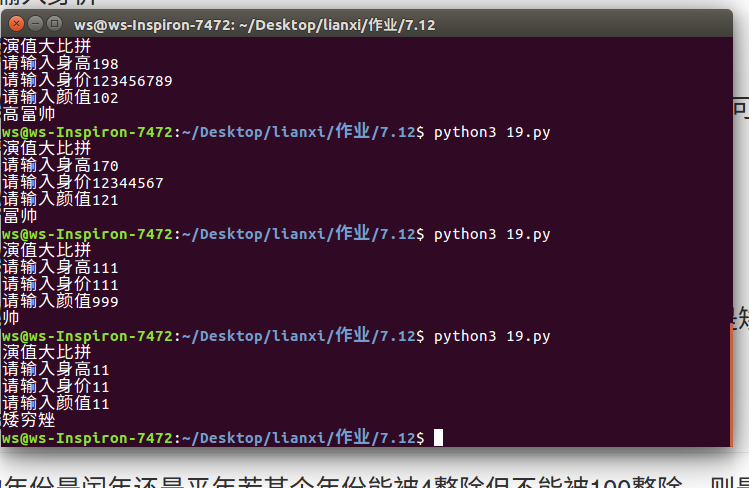
#实战二十: 平年闰年判断
算一下输入的年份是闰年还是平年 若某个年份能被4整除但不能被100整除，则是闰年。 若某个年份能被400整除，则也是闰年 （知识点：不等于 !=）
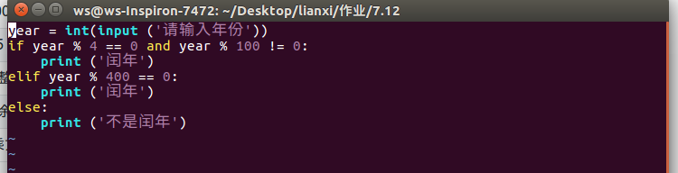
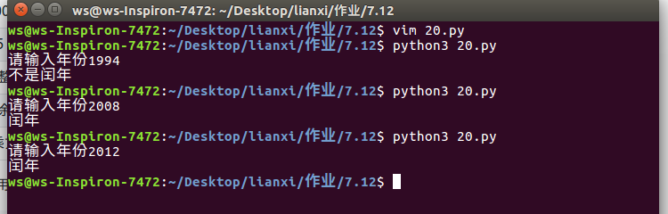

我的　github账号 xiaoyaoshuai@outlook.com