#实战二十一: 模拟支付宝蚂蚁森林的能量产生过程
支付宝的蚂蚁森林通过日常的走步、生活缴费、线下支付、网络购票、共享单车等低碳、环保行为可以积累能量,当能量达到一定数量后,就可以种一颗真正的树。那么本实战将模拟支付宝蚂蚁森林的能量产生过程。
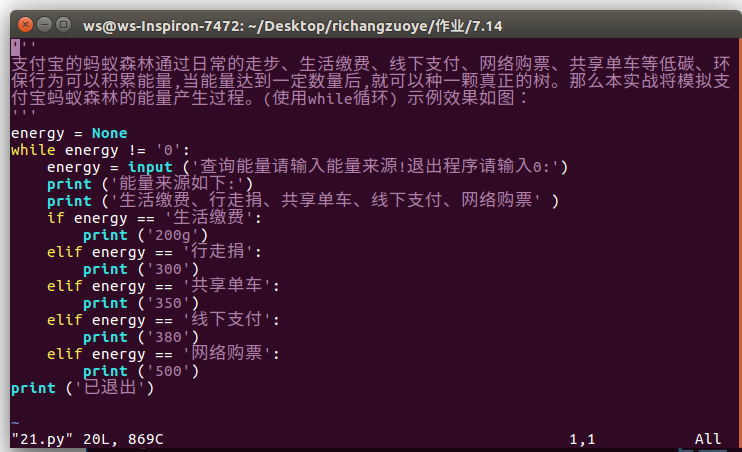

#实战二十二：模拟跳一跳小游戏的加分模块
"跳一跳"小游戏中提供了一些加分模块，当跳到这些模块的时候,会有额外的加分。本实战要求模拟跳一跳小游戏，实现输入不同的加分块，显示相应的应该加的分数
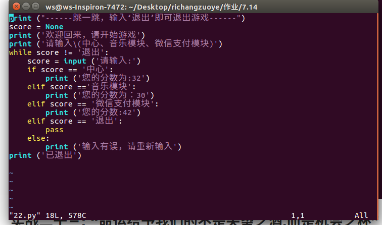
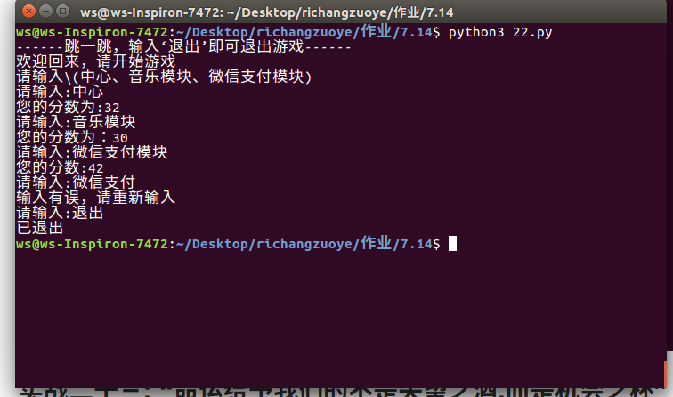
#实战二十三: “命运给予我们的不是失望之酒,而是机会之杯”
用户从终端输入一个数字,如果数字为0,则不输出任何东西,如果数字小于100则输出'命运给予我们的不是失望之酒,而是机会之杯”重复用户输入的这个数字,例如用户输入99,则输出99次这句话,如果输出100结束循环
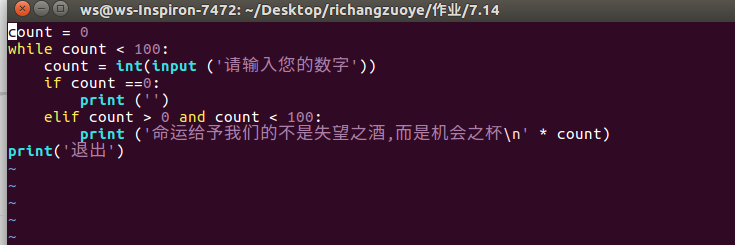
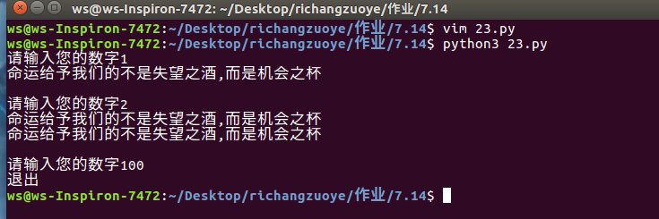
#实战二十四:无独有偶
使用while循环,输出0~100之间所有的偶数
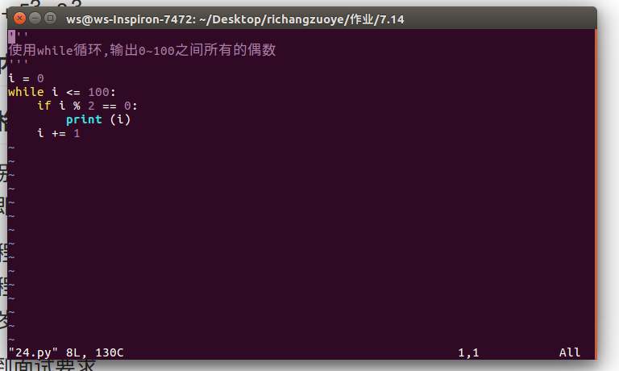
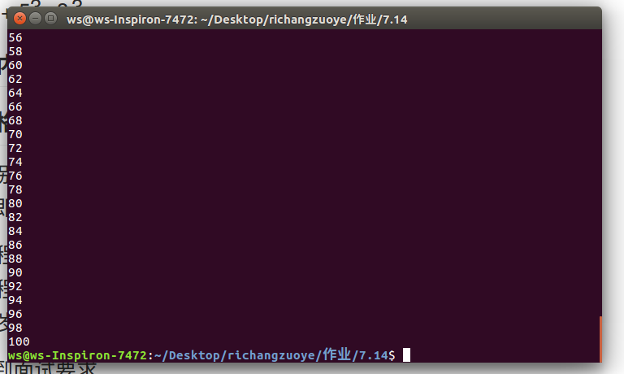
#实战二十五:求1~100之间能被7整除，但是同时不能被5整除的所有整数
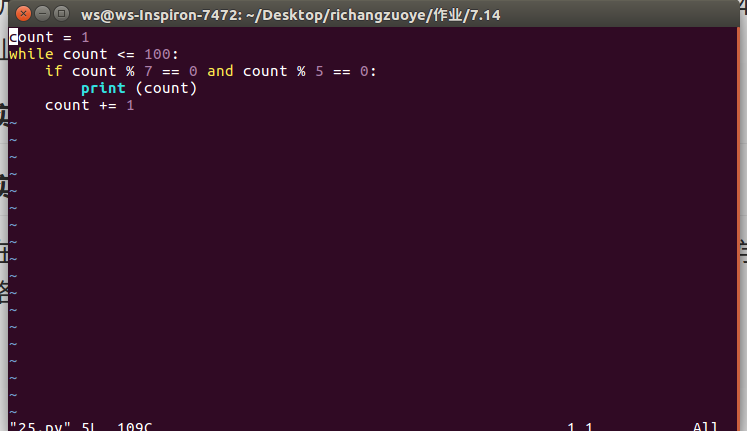
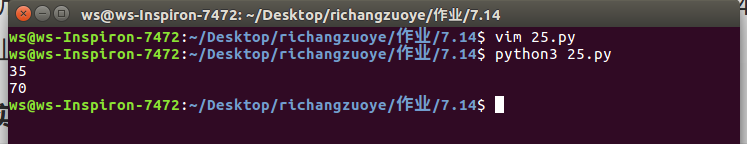
#实战二十六:输出一个‘水仙花数’
所谓水仙花数是指一个3位的十进制数,其各位数字的立方和恰好等于该数本身 例如:153是水仙花数，因为153 = 13 + 53 +3 3
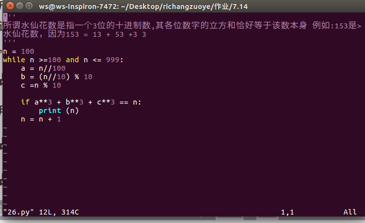
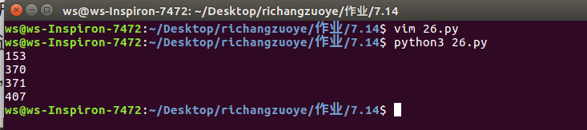

#实战二十七:求200以内能被17整除的最大整数
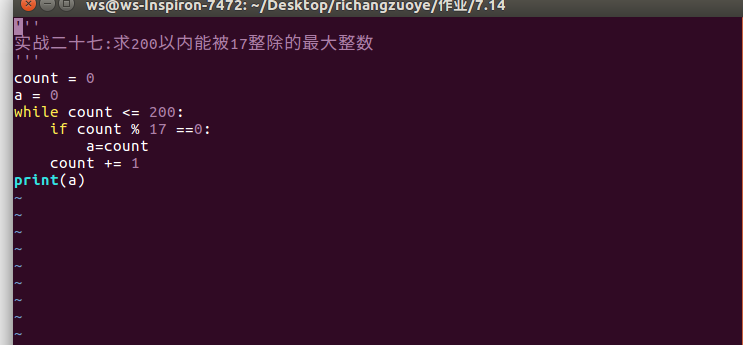
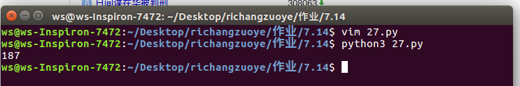
#实战二十八：面试资格确认
在终端输入3组数据,分别为年龄（age）,专业(subject),是否重点大学(college) 录取资格:(满足其中一个条件即可录取)

    电子信息工程专业且年龄大于25岁
    电子信息工程专业且为重点大学
    年龄小于28岁且为计算机专业
否则输出:抱歉,您未达到面试要求
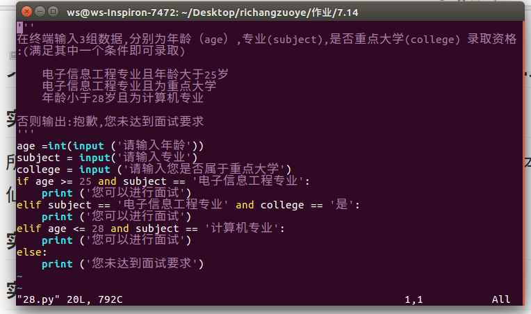
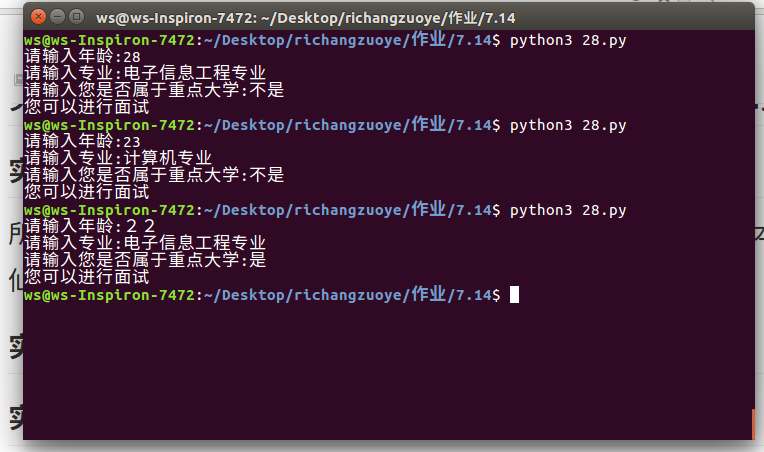
#实战二十九: 鸡兔同笼问题
假设共有鸡、兔30只，脚90只，求鸡、兔各有多少只?

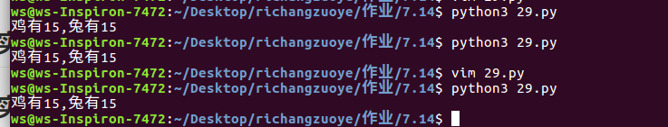
#实战三十: 求50~100之间的偶数之和并且输出
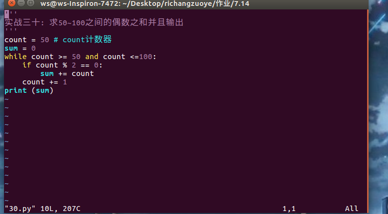
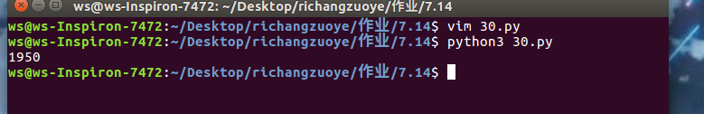